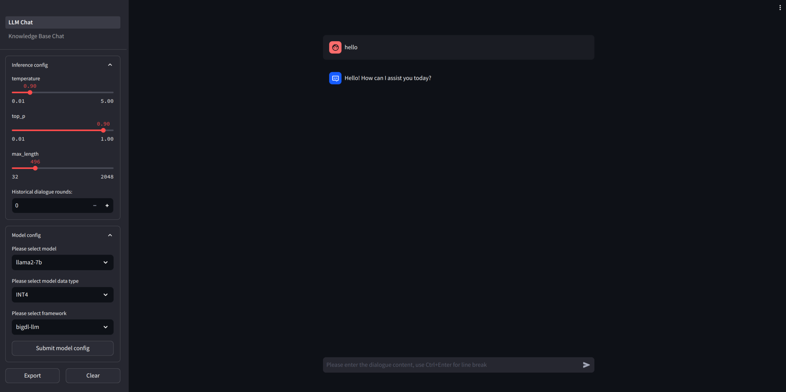
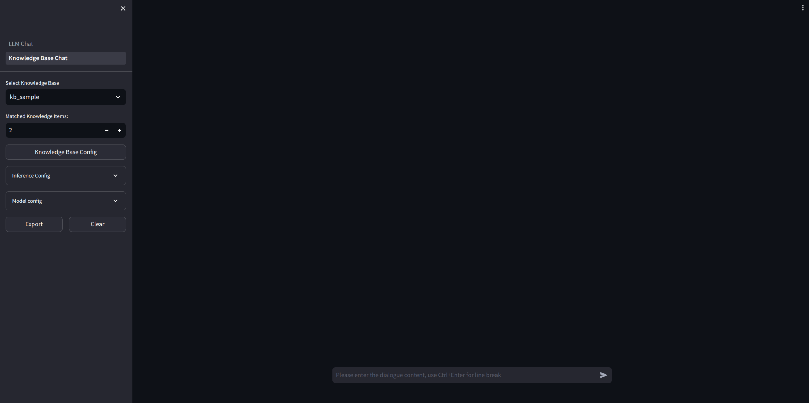

# Web App for LLM Chat and Knowledge Base Chat on Cloud

A LLM chatbot web UI, powered by Streamlit, contains two pages:

- LLM chat page(Home page), based on [LLM-inference-service](../llm-inference-serving/README.md)
    - LLM chat
    - Model config: select model, data type and inference framework
    - Inference config: select temperature, top p, max generated tokens length, histroy length
- Knowledge base chat page, based on [langchain-app-service](../langchain_demo/README.md)
    - LLM chat with Knowledge base
    - Knowledge base config
        - List knowledge base details
        - Select knowledge base
        - Create knowledge base: select vector store and embedding model
        - Upload files to knowledge base
        - Delete knowledge base
    - Model config
    - Inference config






## Usage

### Deploy locally

- LLM chat need to [startup LLM server](../llm-inference-serving/README.md)
- Knowledge base chat need to [startup LLM server and knowledge base(langchain) server](../langchain_demo/README.md)
- Config server url, MODEL_CONFIG, KB_DICT, KB_ROOT_PATH in [configs](./configs)
- Install requirements-webapp.txt: `python3 -m pip install -r requirements-webapp.txt`
- Startup webapp: `streamlit run LLM_Chat.py --server.port 7860`
- Open `localhost:7860` in browser

### Deploy on docker

- Build local image or `docker pull chzhyang/cloud-llm-webapp:v1`

    ```shell
    docker build --build-arg HTTP_PROXY==http://proxy-dmz.intel.com:911 \
    --build-arg HTTPS_PROXY=http://proxy-dmz.intel.com:912 \
    --build-arg NO_PROXY=localhost,127.0.0.1 \
    -f Dockerfile.webapp \
    -t chzhyang/cloud-llm-webapp:v1 .
    ```

- Startup container and run app

    ```shell
    $ docker run --rm -it -p 7860:7860 chzhyang/cloud-llm-webapp:v1 /bin/bash
    $ streamlit run LLM_Chat.py --server.port 7860
        You can now view your Streamlit app in your browser.
    ```

- Open `localhost:7860` in browser

### Deploy with docker compose

- Build local image or `docker pull chzhyang/cloud-llm-webapp:v1`
- Update `docker-compose-webapp-allinone.yaml`
- Run docker-compose: `docker-compose -f docker-compose-webapp-allinone.yaml up`
- Open `localhost:7860` in browser

## TODO

- [ ] deploy on k8s
- [ ] add stream chat
- [ ] support upload file to cloud storage/kb service

